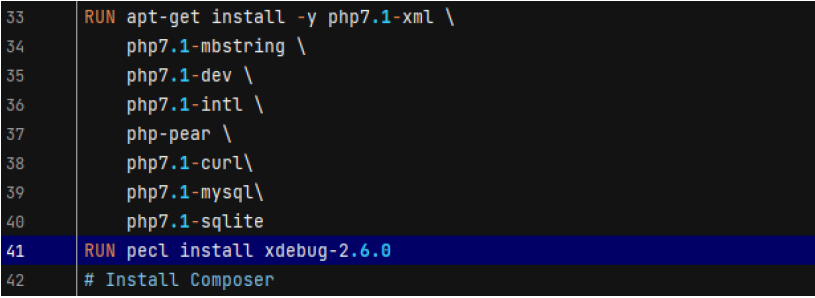
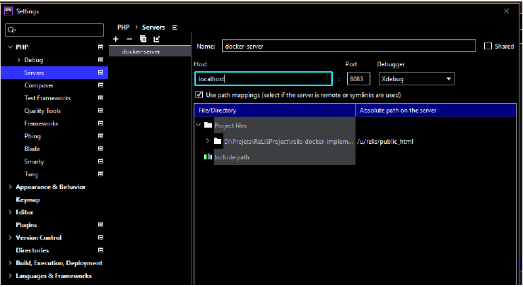
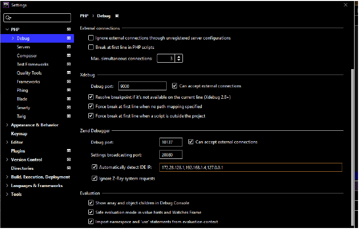
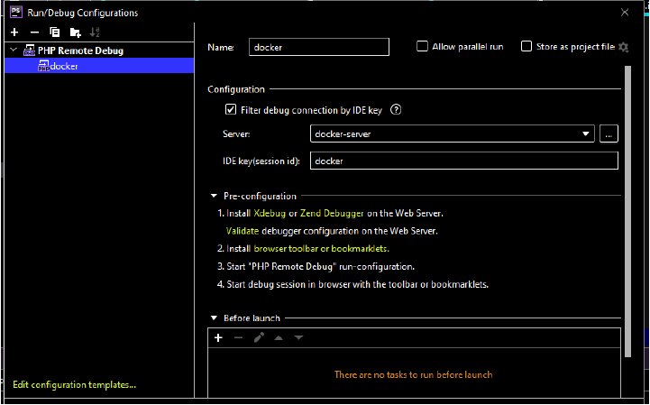
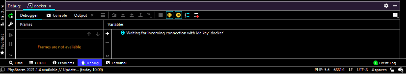

# ReLiS

*ReLiS is a tool for conducting systematic reviews.*

Systematic review is a technique used to search for evidence in scientific literature that is conducted in a formal manner, following a well-defined process, according to a previously elaborated protocol. Conducting a systematic reviews involves many steps over a long period of time, and is often laborious and repetitive. This is why we have created ReLiS which provides essential software support to reviewers in conducting high quality systematic reviews. With ReLiS, you can plan, conduct, and report your review. 

Unlike other systematic review tools, ReLiS is an online tool that automatically installs and configures your projects. You conduct reviews collaboratively and iteratively on the cloud. ReLiS is engineered following a model-driven development approach. It features a domain-specific modeling editor and an architecture that enables on-the-fly installation and (re)configuration of multiple concurrently running projects.

You can use a publicly available instance of ReLiS at [http://relis.iro.umontreal.ca/](http://relis.iro.umontreal.ca/). This GitHub repository allows you to install ReLiS on your servers.

## Features
High-level features supported:
- Collaboration support
- Protocol development and modification iteratively
- Traceability
- Decision tracking
- Support inclusion and exculsion
- Support quality assessment
- Data extraction form
- Data management
- Data maintenance
- Basic statistical analysis
- Report preparation
- Data sharing
- Visualization
- Export studies and data
- Storage of studies (all but PDF)

# Installation
The project can be installed locally using docker. Make sure to follow the pre-requisite steps to have an up and running docker environment.

### Pre-requisite:
- Install docker on your local environment (download at: https://www.docker.com/products/docker-desktop)
- Install docker-compose on your local environment (it comes by default with docker on mac and windows)
- Run command "docker-compose" to check that docker is correctly installed
- For Windows users, if Docker cannot start with the following error : 
  "Hardware assisted virtualization and data execution protection must be enabled in the BIOS" then excute following steps:
  - Enable features : Virtual Machine Platform, Windows Subsystem for Linux and Hyper-V using "Windows Features"
    (See https://docs.docker.com/docker-for-windows/troubleshoot/#virtualization for more information)
  - Restart you system and press esc key or any correspondent key to enter the BIOS settings in windows 
  - Press f10 or other key to enter BIOS Setup
  - Go to System Configuration then Device Configuration 
  - Enable Virtualization 
  - Restart your system
  If Docker still not start with the error "Docker.ApiServices.WSL2.WslKernet NotInstalledException" then excute following steps:
  - use the link https://docs.microsoft.com/en-us/windows/wsl/install-win10#step-4---download-the-linux-kernel-update-package to download and intall linux kernal update 
  - Restart you system if Docker not start 

### Build and run the application:
1. Clone the project from GitHub (git clone https://github.com/geodes-sms/relis.git)
2. Run following command from the directory **relis_deployment/**
   > docker-compose build 
   

3. Run following command from the directory **relis_deployment/**
    > docker-compose up -d
   
4. (For **windows users** , if you get the error `relis-application-service | standard_init_linux.go:211: exec user process caused "no such file or directory"`: check if the file **relis_deployment/docker/entrypoint.sh** EOL is not CRLF;  if it is, convert it from CRLF to LF and go back to step 3.)
5. From your browser go to url **localhost:8083** to access the application. Default credentials  are: `Username: admin` `Password: 123`
6. For test purpose you can also access the database using PHPMyAdmin on **localhost:8083/phpmyadmin**. Default credentials are: `Username: root` `Password:`
   
   **No password required** (You should use this feature only on the local environment). 
   
7. If you get the error "Incorrect permissions on the configuration file, it should not be write to everyone!" then add the statement **`$cfg['CheckConfigurationPermissions'] = false;`** to the phpmyadmin config file: **relis-docker-implementation\phpmyadmin\config.inc.php**

### Useful command
To connect inside your docker container run the following command from the directory **relis_deployment/** 
 > docker-compose exec relis-application bash 

Make sure the user has the rights to access and edit the `workspace/` folder. For example, run
 > chmod -R 755 workspace

Make sure the user has the rights to access and edit the `export_r/` folder. For example, run
 > chmod -R 777 cside/export_r/

### PHP Container Debug with Xdebug and PhpStorm

1. Update **relis_deployment/docker/Dockerfile** by adding: `RUN pecl install xdebug-2.6.0`


2. Add xdebug setting to **relis_deploymant\docker\php\conf\apache\php.ini** :
```ini
[xdebug]
zend_extension=xdebug.so
xdebug.remote_enable=1
xdebug.remote_handler=dbgp
xdebug.remote_port=9000
xdebug.remote_autostart=1
xdebug.remote_connect_back=0
xdebug.idekey=docker
xdebug.remote_host=host.docker.internal
zend_extension=xdebug.so
```

3. **Configure server in PhpStorm**: In `File -> Setting -> PHP ->Server`. Add a new server using + icon, and configure it like on the following screenshot
   


**Note**: Make sure to check "Use path mappings" and map your implementation folder (for example: **D:\Projects\ReLiSProject\relis-docker-implementation**) to **/u/relis/public_html**

You can also check debug setting, Debug port : 9000



4. **Configure Php remote debugger in PhpStorm**: In `Run -> Edit configurations -> PHP Remote Debug`. Add a new configuration and give it values like on the following screenshot:



5. **Build ReLiS docker image and Run ReLiS**
   - Run following command from the directory **relis_deployment/**
   > docker-compose build
   
   - Run following command from the directory **relis_deployment/**
   > docker-compose up -d
   
6. **Debugging**: To debug click on Run and choose “docker” then you will notice that the debugger is waiting for incoming connection with ide key ‘docker’.



# Application structure on GIT

### Branch naming convention:
- `prod`: is the branch that is used in production
- `master`: is the main branch used for final testing
- `develop`: is the branch on which we develop 
- `feature-X` _(feature branch)_: X represents the feature we are working on (the number of the ticket if the feature is a task in github or a keyword for the task).
 
### Development process:
1. **Create new task** : For any new task create a feature branch from develop before getting the last version of develop:
	> git checkout develop
    > 
	> git pull origin develop
	>
    > git checkout -b feature-taskNumber
2. **Add your code**: Add all changes needed in your feature branch
3. **Update documentation**: Go to [initial_db.sql](https://github.com/geodes-sms/relis/blob/develop/relis_deployment/docker/db/initial_db.sql) by updating or inserting the text in the `info` table (starting at line 141).
4. **Create a pull request(PR) to the branch develop**: When the code is ready to be merged, create a pull request to the branch develop. To avoid conficts while merging the code, make sure to pull the last version of develop  in the feature branch before creating an PR.
5. Repeat steps 1 to 3 for each new task.

### Deployment process:
1. Merge develop to master: when the code is ready to be fully tested the code is merged to master
2. Deploy the branch master on a test server and proceed with testing,
3. Deploy in production: merge the master branch in prod and pull the changes on the production server.


# Distribution

# Source code
To compile the source code, you need the following dependencies:
- 

The source code is licensed under a [GNU GENERAL PUBLIC LICENSE 3](https://www.gnu.org/copyleft/gpl.html) 

# Change log
### Version 1.0

