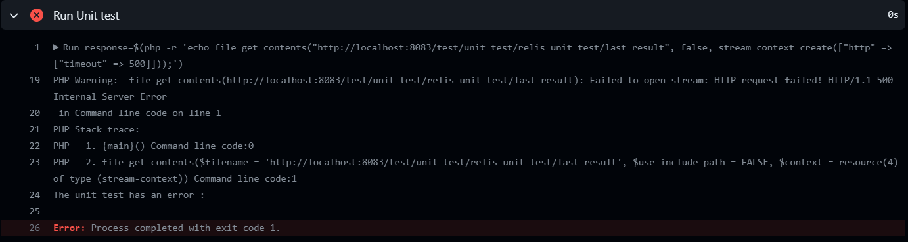

# ReLiS unit testing

## Table of Contents

* [Introduction](#introduction)
* [Installation](#installation)
* [Implementation](#implementation)
* [Running the Tests](#running-the-tests)
* [Disable, delete and add test functions](#disable-delete-and-add-test-functions)
* [GitHub Deployment](#github-deployment)
* [Pull Request Safeguard Mechanism](#pull-request-safeguard-mechanism)

## Introduction

This unit test for ReLiS project aims to provide robust quality assurance by quickly identifying and addressing potential regressions, ensuring a smooth and reliable user experience. The introduction of automated unit tests aligns with a proactive approach to anticipate the impacts on the code during future developments of the application.

The choice of framework for conducting unit tests in ReLiS leaned towards the **Unit Testing** library. This selection was driven by the fact that this library serves as the integrated testing framework within the CodeIgniter 3 framework, making it seamlessly compatible with both PHP 7.1 and CodeIgniter 3, the technologies employed in ReLiS.

This README file offers a comprehensive overview of the unit testing implementation for the ReLiS application. The following points are outlined to provide insight into the implementation and maintenance of unit tests:

* `Installation of Unit Test Framework Tools`: Describes the necessary tools required for installing the unit test framework.
* `Installation of the Unit Test Framework`: Provides guidance on installing the unit test framework.
* `Implementation of Unit Tests`: Details the process of implementing unit tests for the ReLiS application.
* `Execution and Modification of Unit Tests`: Explains how to run, modify, add, enable, and disable unit tests.
* `GitHub Deployment`: Outlines the steps to deploy the tests on Github to be able to run when code is pushed to remote repo.
* `Implementation of Pull Request Safeguard Mechanism`: Describes the mechanism in place to prevent pull requests into the main branch in the event of unit test failures, ensuring the integrity of the codebase.

## Installation

The Unit Testing class is integrated into CodeIgniter 3 and doesn't require any separate installation. To use the Unit Testing class, you simply initialize it in the controller using the **$this->load->library** function, like so: `$this->load->library('unit_test')`. Once loaded, you can access the Unit Test object through **$this->unit**. 

In ReLiS, the Unit Testing class is initialized in the file [Unit_test.php](../../controllers/test/Unit_test.php).

## Implementation

As mentioned earlier, unit tests have been implemented using the CodeIgniter 3 **Unit Testing** library. Additionally, the **cURL** library initialized in [curl_helper.php](../tests/helpers/curl_helper.php), was utilized for making HTTP calls to all functions within the tested controllers. Each tested controller has its dedicated file in the [tests](../tests/) directory, where all tests for the controller's functions are implemented. For instance, all tests for the **Reporting** controller can be found in the file [reporting_ut_helper.php](../tests/reporting_ut_helper.php).

All the test files for controllers are initialized in the [Unit_test.php](../../controllers/test/Unit_test.php) file, where all the tests are executed using the following code:

* `$this->unit->report()`: Prints out a formatted report in the browser. This report includes details such as the tests passed and failed, the number of tests run, the number of tests passed and failed, along with additional information on the time taken for the tests.
* `$this->unit->last_result()`: This function returns either **successful** or **failed** to indicate whether the tests have passed or failed. It is used in the GitHub unit testing action to determine the outcome of the tests, providing a clear indication of whether the tests were successful or not.

## Running the Tests

### Running the tests from a web browser

To run the tests, first build and run the application with the following commands:
 * Run following command from the directory **relis_deployment/** to build the application
   > docker-compose build 
 * Run following command from the directory **relis_deployment/** to run the appication
   > docker-compose up -d
  
Then from your web browser go to the following URL: `http://localhost:8083/test/unit_test/relis_unit_test`. This will generate a report providing details such as passed and failed tests, the number of tests run, the number of tests passed and failed, and additional information on the time taken for the tests.

### Running the tests from Github action

The creation of a configuration file in the **.yml** format, as described in the [GitHub Deployment](#github-deployment) section, enables automatic test execution on GitHub with each push using the `git push` command on the **develop** branch. The precise steps involve in the execution are outlined in the [GitHub Deployment](#github-deployment) section. Three possible results can be returned from the test:

* `successful`: This result is returned when the unit test is successful.
* `failed`: This result is returned when the unit test encounters a failure. To identify the specific test that failed, you can run the test in a web browser following the instructions provided in the [Running the tests from a web browser](#Running-the-tests-from-a-web-browser) section.
* `error`: This result is returned when an error occurs during the test execution. To determine the nature of the error, follow the steps outlined below:

    - Comment out the permission lines in the action workflow configuration file [relisUnitTest.yml](../../../.github/workflows/relisUnitTest.yml), as illustrated in the image below:
      
    - Push the changes to the GitHub remote repository.
    - In the `Run Unit test` section of the workflow, a block of HTML code will be generated, describing the error as depicted in the following image:
      
    - Copy the HTML code to an HTML file and open the file with a web browser to view the actual error details.

### Enable and disable tests

The controllers' tests are enabled or disabled individually by uncommenting or commenting the line of code that runs the corresponding controller test in [Unit_test.php](../../controllers/test/Unit_test.php). For example, to enable the test for the screening controller, simply uncomment the line of code responsible for running the screening controller tests, like so: `$this->screeningUnitTest->run_tests();`.

## Disable, delete and add test functions

### Disable/delete test functions

To disable a test function, simply comment the call to that function. For example, to disable the **logout()** test function, you can comment the call to that test function in [user_ut_helper.php](../../helpers/tests/user_ut_helper.php). Alternatively, you can delete the test function for permanent removal. 

As some test functions depend on others, ensure that disabling or removing a function does not break the execution of other test functions.

### Adding test functions

1. Add a new test function to an existing or new test class helper in [tests](../tests/) while adhering to the following structure:

    * `Comment block before the test function declaration`: provide a brief description of the test. It specifies the controller, action, and the expected outcome.
    * `Test variables`: Several variables are initialized with specific values related to the test:
      - `$action`: The controller action being tested.
      - `$test_name`: A descriptive name for the test.
      - `$test_aspect`: Describes the aspect being tested.
      - `$expected_value`: The expected result from the test
      - `$actual_value`: The actual result from the test
    * `Response Handling`: Checks the HTTP response status code. If the status code is greater than or equal to 400, it sets the actual value to a red-colored message containing the error message from the http request.
    * `Test Execution`: Finally, the function calls the **run_test** function with the test parameters, including the controller, action, test name, test aspect, expected value, and actual value.

2. In case of new test class helper in [tests](../tests/): 

    * `Remane your test class helper file`: Renaming your test helper file can be a tricky task due to potential issues in the GitHub Action workflow. It has been observed that certain file names, such as renaming the **user** test helper to **userUnitTest_helper.php**, may result in an error during the GitHub Action workflow. Unfortunately, the exact cause of this error is currently unknown. The naming error is manifested in the GitHub Action as depicted below:
      

    * `Name suggestion`: As a recommended naming convention, consider using the following pattern for your class helper file: `[controller name]_ut_helper`. For example, if you have a **user** controller, the appropriate name for the test class helper would be `user_ut_helper`, where **ut** signifies **unit test**. Adhering to this naming convention may help avoid issues in the GitHub Action workflow.

    * `Add reference to the test helper`: initialize, load, and run the test class in [Unit_test.php](../../controllers/test/Unit_test.php) file with the following lines of code: 
      - `private $newclassUnitTest;`: In the variable declaration section
      - `$this->load->helper('tests/newclassunittest');`: In the constructor
      - `$this->newclassUnitTest = new NewclassUnitTest();`: In the constructor
      - `$this->newclassUnitTest->run_tests();`: In the **relis_unit_test()** function

It is advisable to add a new test function at the end of the test class to avoid disrupting the execution flow of other tests, especially since some tests are dependent on others. This precaution is recommended unless you are familiar with the dependencies and potential impacts on the test suite.

## GitHub Deployment

The [relisUnitTest.yml](../../../.github/workflows/relisUnitTest.yml) configuration file outlines the steps for configuring the environment and running unit tests on GitHub. With each new code push to the **develop** branch, the defined steps in the configuration file will be executed as follows:

* `Step 1. Checkout Code`: Uses the action actions/checkout to retrieve the project's source code.
* `Step 2. Docker Installation Check`: Verifies if Docker is installed in the remote GitHub repository.
* `Step 3. Docker Image Build`: Uses the command **docker-compose build** to construct the Docker image in the remote GitHub repository.
* `Step 4. Docker Containers Execution`: Uses the command **docker-compose up -d** to start the Docker containers.
* `Step 5. Application Startup Wait`: Waits for 10 seconds to allow the containers to start.
* `Step 6. Permissions Assignment to the "relis-app" Container and cside/export_r directory`: Modifies the permissions of the **relis-app** container and **cside/export_r** directory to ensure access.
* `Step 7. Unit Tests Execution`: Executes the unit tests.
* `Step 8. Stop All Docker Containers`: Stops all Docker containers after the tests have been executed.

Changes made to the local repository will be pushed to the **develop** branch, regardless of the success or failure of the unit tests in the workflow execution.

## Pull Request Safeguard Mechanism

The implementation of the **main** branch protection system is achieved as follows:

* Go to the settings tab of the repository on the rightest side 
  

* In the `Code and automation` section of the sidebar, click on `Branches`.
* Click on `Add rule`.
* Under `Branch name pattern`, enter the branch name or pattern you want to protect (e.g. `main` in our case).
* Enable `Require status checks to pass before merging`.
* In the search field, search for status checks you want to require before merging (`relis_unit_testing` in our case)
* Select `Do not allow bypassing the above settings` if the status check is mandatory during merging and cannot be bypassed.
* Click on `Create`

* if the latest code push to the **develop** branch fails the unit test, the **Merge pull request** button will be disabled, preventing the initiation of the merge.
  

* When a new push is made, the status check is restarted on the latest action workflow run
  

* When the status check pass, the “merge pull request” button is activated to allow the merging.
  

Changes made to the local repository will always be pushed to the **develop** branch, regardless of the success or failure of unit tests. However, the **main** branch will only permit code merging if the latest code push to the **develop** branch successfully passes the unit tests.
